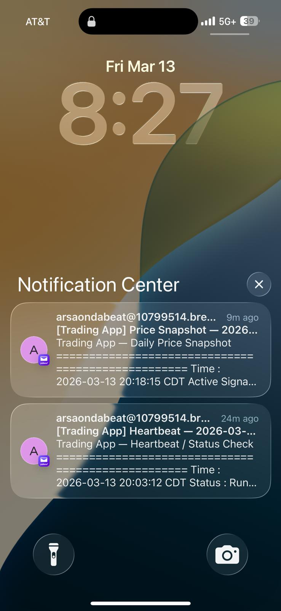
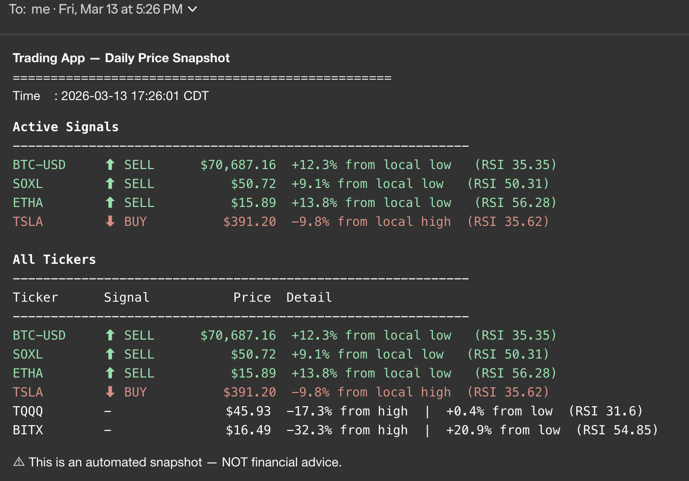
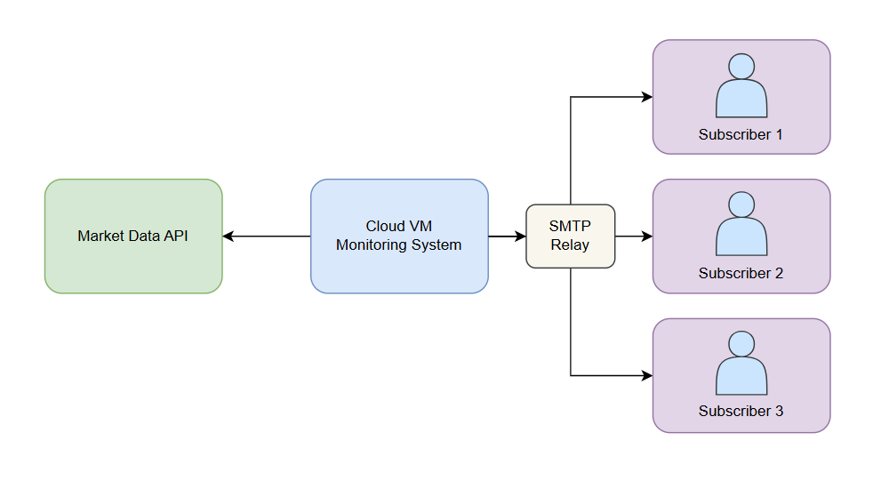

# Stock Alert System

A 24/7 stock and crypto price monitoring bot that sends email alerts when a
ticker drops or rises significantly from its recent local high or low. Designed
to run on a free Google Cloud e2-micro VM with zero ongoing cost.

---

## Preview

| Alert Email | Email Content |
|:-----------:|:-------------:|
|  |  |

---

## Table of Contents

1. [What It Does](#1-what-it-does)
2. [Architecture](#2-architecture)
3. [Resource & Rate Limits](#3-resource--rate-limits)
4. [Setup Guide](#4-setup-guide)
5. [Deployment to Google Cloud](#5-deployment-to-google-cloud)
6. [Key Files](#6-key-files)

---

## 1. What It Does

The bot polls a configurable list of tickers at a regular interval. For each ticker it:

- Fetches and maintains a rolling history of price data for each ticker
- Analyzes price movements to detect notable shifts in market direction
- Sends **email alerts** when the price moves significantly from its recent reference point
- Sends daily scheduled emails: a morning/evening **heartbeat**, an evening **stats summary**, and a **price snapshot** for all tickers

Monitored tickers are fully configurable and support any stock or crypto symbol available on Yahoo Finance.

---

## 2. Architecture



### Components

| Component | Role |
|-----------|------|
| `trading_app.py` | Orchestrates the polling loop, evaluates buy/sell conditions, sends alert and scheduled emails |
| `finance_client.py` | MCP client that communicates with the Yahoo Finance server subprocess; computes RSI, Bollinger Bands, MACD, ATR |
| `server.py` | Yahoo Finance MCP server (upstream, not modified); runs as a subprocess and responds to data requests over stdin/stdout |
| `trading_config.json` | Single source of truth for tickers, SMTP credentials, alert thresholds, and polling interval |
| `price_history/*.csv` | Per-ticker rolling CSV of hourly OHLCV bars; appended each poll cycle, pruned automatically |
| `trading_state.json` | Tracks per-ticker alert state (last alert price, last local high/low); deleted and rebuilt on every restart |

### Data Flow

1. **Startup**: For each ticker, a history fetch populates `price_history/`.
2. **Each poll cycle**: One lightweight current-quote call per ticker is made. The quote is appended to the CSV and the alert logic runs.
3. **Alert**: If a buy or sell condition is met, an email is sent via Brevo SMTP.
4. **State reset**: On every restart, all state and history CSVs are cleared and rebuilt fresh.

---

## 3. Resource & Rate Limits

### Yahoo Finance API Call Budget

| Metric | Value |
|--------|-------|
| Calls on startup (history fetch) | 1 per ticker |
| Calls per poll cycle | 1 per ticker |
| Approximate calls per hour | ~24 (6 tickers × 4 cycles/hour) |
| **Approximate daily total** | **~576** |
| **Hard daily cap (encoded)** | **1,000 calls/day** — app auto-pauses all YF calls once reached and resumes the next day |

### Email Budget (Brevo Free Tier)

| Metric | Value |
|--------|-------|
| **Hard daily cap (encoded)** | **250 emails/day** |
| Brevo free tier limit | 300 emails/day |
| Buffer | 50 emails/day headroom |
| Error email cooldown | 1 per error type per hour |

### Storage

| Resource | Limit |
|----------|-------|
| Price history CSVs | Older rows are pruned on every write; total < 5 MB |
| Error log (`trading_errors.log`) | **Hard cap: 10 MB** — oldest half discarded when exceeded |

### Memory (Google Cloud e2-micro)

| Resource | Value |
|----------|-------|
| RAM | 1 GB |
| Swap file (recommended) | 1 GB (prevent OOM crashes during numpy/pandas operations) |
| vCPU | 0.25 shared core |

The bot is well within the e2-micro limits during normal operation. The swap file is a safety net for the startup history fetch which briefly spikes memory.

---

## 4. Setup Guide

### Prerequisites

- macOS or Linux
- Python 3.11 or later

### Step 1 — Clone the repository

```bash
git clone <your-repo-url> stock-alert-system
cd stock-alert-system/yahoo-finance-mcp
```

### Step 2 — Create a virtual environment

```bash
python3 -m venv .venv
source .venv/bin/activate
```

### Step 3 — Install dependencies

```bash
pip install "mcp[cli]>=1.6.0" "yfinance>=0.2.62"
```

### Step 4 — Create the config file

Save the following as `trading_config.json` in the `yahoo-finance-mcp/` directory and fill in your credentials:

```json
{
  "notify_email":          "you@example.com",
  "smtp_host":             "smtp-relay.brevo.com",
  "smtp_port":             587,
  "smtp_from":             "you@gmail.com",
  "smtp_user":             "your_brevo_login@smtp-brevo.com",
  "smtp_password":         "your_brevo_smtp_key",
  "tickers":               ["TQQQ", "BTC-USD", "SOXL", "BITX", "ETHA", "TSLA"],
  "poll_interval_seconds": 900,
  "drop_min_pct":          5,
  "rise_min_pct":          5,
  "lookback_period":       "30d",
  "lookback_interval":     "1h",
  "local_window_bars":     40
}
```

| Field | Description |
|-------|-------------|
| `notify_email` | Where alert emails are delivered |
| `smtp_from` | The "From" address shown in emails (must be verified in Brevo) |
| `smtp_user` | Brevo SMTP login (e.g., `xxxxxxx@smtp-brevo.com`) |
| `smtp_password` | Brevo SMTP key — keep this secret, do not commit to git |
| `tickers` | Yahoo Finance symbols; crypto uses `-USD` suffix (e.g., `BTC-USD`) |
| `poll_interval_seconds` | Polling frequency in seconds |
| `drop_min_pct` | Minimum % drop from local high to trigger a BUY alert |
| `rise_min_pct` | Minimum % rise from local low to trigger a SELL alert |

> **Security**: Add `trading_config.json` to `.gitignore` — it contains your SMTP secret key.

### Step 5 — Get Brevo SMTP credentials

Brevo offers a free tier of **300 emails/day** with no credit card required.

1. Sign up at [https://app.brevo.com/](https://app.brevo.com/)
2. Go to **account name → SMTP & API → SMTP tab**
3. Click **Generate a new SMTP key**, name it, and copy it immediately (shown once)
4. Go to **Settings → Senders & IP → Add a sender** and verify the email you will send from
5. Fill in `smtp_user`, `smtp_password`, and `smtp_from` in your config

### Step 6 — Run the app

```bash
python trading_app.py
```

**Test mode** (one cycle, no emails sent):
```bash
python trading_app.py --test
```

**Snapshot test** (sends the HTML price table email immediately):
```bash
python trading_app.py --snapshot-test
```

---

## 5. Deployment to Google Cloud

Google Cloud offers a **permanently free** e2-micro VM — this is not a trial, it is free indefinitely within the free tier limits.

**Free tier requirements:** region `us-central1`, `us-east1`, or `us-west1`; 30 GB standard disk; 1 GB egress/month.

### Step 1 — Create a GCP project and VM

1. Go to [console.cloud.google.com](https://console.cloud.google.com) and create a new project
2. Navigate to **Compute Engine → VM instances → Create Instance**
3. Configure:

| Setting | Value |
|---------|-------|
| Region | `us-central1` |
| Zone | `us-central1-a` |
| Machine type | `e2-micro` |
| Boot disk | Debian 12, Standard disk, 10 GB |

4. Click **Create** and wait for the green checkmark

### Step 2 — Install gcloud CLI

```bash
brew install --cask google-cloud-sdk
export PATH="/opt/homebrew/share/google-cloud-sdk/bin:$PATH"  # add to ~/.zshrc
gcloud auth login
gcloud config set project YOUR_PROJECT_ID
```

### Step 3 — Package and upload the app

```bash
cd /path/to/yahoo-finance-mcp

tar --exclude='.venv' \
    --exclude='__pycache__' \
    --exclude='*.egg-info' \
    --exclude='price_history' \
    --exclude='trading_state.json' \
    --exclude='trading_errors.log' \
    --exclude='assets' \
    -czf /tmp/stock-alert-notifier.tar.gz .

gcloud compute scp /tmp/stock-alert-notifier.tar.gz \
  vm-stock-notificator:/tmp/stock-alert-notifier.tar.gz \
  --zone=us-central1-a
```

### Step 4 — Set up the VM

```bash
gcloud compute ssh vm-stock-notificator --zone=us-central1-a
```

On the VM:

```bash
# Swap file (recommended to prevent OOM on 1 GB RAM)
sudo fallocate -l 1G /swapfile && sudo chmod 600 /swapfile
sudo mkswap /swapfile && sudo swapon /swapfile

# Python
sudo apt-get update -qq && sudo apt-get install -y python3 python3-venv

# Extract and install
mkdir -p ~/stock-alert-notifier && cd ~/stock-alert-notifier
tar -xzf /tmp/stock-alert-notifier.tar.gz
python3 -m venv .venv
.venv/bin/pip install "mcp[cli]>=1.6.0" "yfinance>=0.2.62"
```

Place your `trading_config.json` in `~/stock-alert-notifier/`.

### Step 5 — Create a systemd service

```bash
sudo tee /etc/systemd/system/stock-alert-notifier.service > /dev/null << 'EOF'
[Unit]
Description=Stock Alert System — price monitor
After=network-online.target
Wants=network-online.target

[Service]
Type=simple
User=YOUR_USERNAME
WorkingDirectory=/home/YOUR_USERNAME/stock-alert-notifier
ExecStart=/home/YOUR_USERNAME/stock-alert-notifier/.venv/bin/python trading_app.py
Restart=always
RestartSec=30
StandardOutput=journal
StandardError=journal

[Install]
WantedBy=multi-user.target
EOF

sudo systemctl daemon-reload
sudo systemctl enable stock-alert-notifier
sudo systemctl start stock-alert-notifier
sudo systemctl status stock-alert-notifier
```

> Run `whoami` on the VM to find your `YOUR_USERNAME`.

### Step 6 — Verify

Watch the logs — you should see history fetches then the polling loop start:
```bash
sudo journalctl -u stock-alert-notifier -f
```

You will also receive a startup notification email if SMTP is configured correctly.

### Updating after code changes

```bash
# Re-package and push from your Mac:
tar --exclude='.venv' --exclude='__pycache__' --exclude='*.egg-info' \
    --exclude='price_history' --exclude='trading_state.json' \
    --exclude='trading_errors.log' --exclude='assets' \
    -czf /tmp/stock-alert-notifier.tar.gz .

gcloud compute scp /tmp/stock-alert-notifier.tar.gz \
  vm-stock-notificator:/tmp/stock-alert-notifier.tar.gz --zone=us-central1-a

gcloud compute ssh vm-stock-notificator --zone=us-central1-a --command='
  cd ~/stock-alert-notifier &&
  tar -xzf /tmp/stock-alert-notifier.tar.gz &&
  sudo systemctl restart stock-alert-notifier &&
  sudo systemctl status stock-alert-notifier --no-pager'
```

---

## 6. Key Files

| File | Purpose |
|------|---------|
| `trading_app.py` | Main process — polling loop, alert logic, email sending, scheduling |
| `finance_client.py` | MCP client — fetches prices, computes RSI/Bollinger/MACD/ATR, detects swing highs/lows |
| `server.py` | Yahoo Finance MCP server subprocess (upstream, unmodified) |
| `trading_config.json` | All configuration and credentials |
| `trading_state.json` | Per-ticker alert state (auto-created, cleared on restart) |
| `trading_errors.log` | Error log, hard-capped at 10 MB |
| `price_history/*.csv` | Hourly OHLCV bars per ticker, pruned automatically |

---

*For personal informational use only. Nothing this system sends constitutes financial advice.*
